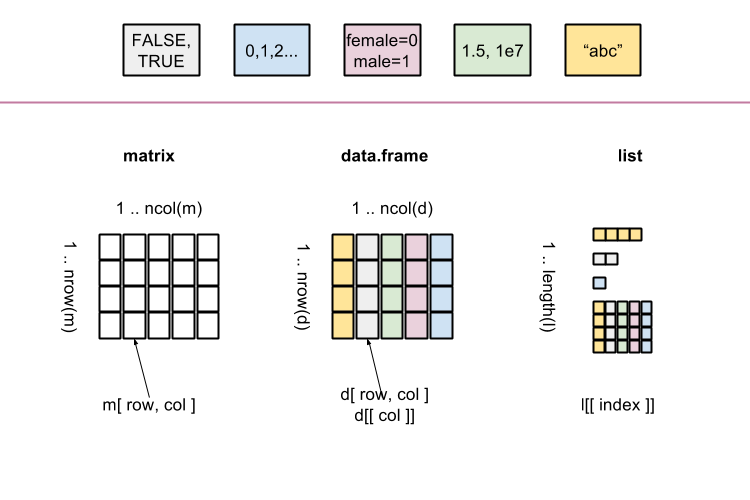

# Data types, part 1

## Basic data types (cont.) 

### Missing values

Numeric, character, logical vectors, factors might contain elements marked as 'missing'.

`NA` is a constant which indicates a missing value.

`NA` values can be included in all objects in R.

### Numeric vectors 

Vector: set of values put together in a certain order

Numeric vector: set of *numbers* put together in a certain order

Below we will see some ways to create numeric vectors.

#### Sequences of numbers 

One way of creating sequences of numbers is to use the operator `:`. It creates a sequence of consecutive integers starting by the first argument, and ending by the last one. For example:

```{r}
3:17
```

It can also be used to create sequences in decreasing order:

```{r}
17:3
```

Negative arguments are also allowed:

```{r}
-3:10
-2:-7
```

So `:` can be used to create sequences with steps of 1 between elements. Sometimes we want to create sequences with steps of a different value. For this, `seq()` is useful:

```{r}
seq(from = 3, to = 17, by = 1)
```

This creates the same sequence as with `3:17`. If we wish to use a step of 2, all we do is:

```{r}
seq(from = 3, to = 17, by = 2)
```

Above `seq()` was called by naming the arguments `from`, `to` and `by`. The argument names can be omited if they are given in the expected order `from--to--by`:

```{r}
seq(from = 3, to = 17, by = 2)
```

#### Combining multiple numbers

Multiple numbers can be combined to create numeric vectors:

```{r}
c(3, 5, 7, 8)
```

Entries in `c()` may include any type of number, or operation yielding a number, and the result will be a numeric vector. For example:

```{r}
x <- c( 5, -2.5, NA, 7+3, 1/3 )
x
class(x)
```

Note that a single value is in fact a vector of length 1:

```{r}
x <- 7
class(x)
```

#### Combining  vectors of numbers

Multiple vectors can be combined together:

```{r}
v <- 1:9
w <- seq( 10, 90, 10 )
res <- c( 0, v, w, NA, 100 )
res
class(res)
```

```{r results="asis", echo=FALSE, comment=""}
catLinkTaskSection( "numeric", "exercises/01_basic_data_types_cont.Rmd" );
```


### Character vectors 

Just like with numeric vectors, there are several ways to construct a character vector. First let us define what a string of characters  is.

#### String of characters

A character string, or string of characters, is essentially a combination of characters. These can be letters "a", "A", "b", as well as numbers and other character types such as '.' and '_'. A character string can be defined by declaring it between quotes - they can be double:

```{r}
"Bioinformatics"
```

or single:

```{r}
'Biostatistics'
```

The initial quote must match the last one.

In R everything is case-sensitive, including character strings. This means that 'Biostatistics' and 'biostatistics' are in fact different strings.

Other examples of character strings are:

```{r}
"day1"
"June 2024"
'first.And.Second'
'file_name'
```

#### Character  vector

Multiple  character strings can be combined to create a character vector using `c()`. For example:

```{r}
x <- c( "Bioinformatics", "Biostatistics", "June2024", NA, "particiPants" )
x
class(x)
```


### Logical vectors and operators

#### Logical vectors 

Elementary logical values are:

```{r}
TRUE
FALSE
T
F
```

A logical vector can be created by combining logical values with `c()`:

```{r}
x <- c( FALSE, F, NA, TRUE, T )   
x
class(x)
```


#### Logical operators

##### Negation

Unary negation operator (denoted `!`):

```{r}
!TRUE
!FALSE
```

##### AND Operator `&`

Binary operator AND (denoted `&`) returns `TRUE` result when *all* its arguments are `TRUE`:

```{r}
TRUE & TRUE
```

Otherwise it returns `FALSE`:

```{r}
FALSE & TRUE
FALSE & FALSE
```

##### OR operator `|`

Binary operator OR (denoted `|`) returns `TRUE` result when *any* (at least one) of its arguments is `TRUE`:

```{r}
TRUE | TRUE
FALSE | TRUE
```

Otherwise it returns `FALSE`:

```{r}
FALSE | FALSE
```

#### Relational operators

##### Equality operator `==`

```{r}
1 == 2
"Bioinformatics" == "Biostatistics"
"biostatistics" == "Biostatistics"
FALSE == F
```

##### Inequality operators 

Not equal:

```{r}
1 != 2     
"a" != "A"
FALSE != T
```

As you can see, this can be used for numeric entries, character strings as well as logical values.

The operators "less than" ("<"), greater than (">") as well as their combinations with "equal" ("=") are mostly used with numeric entries:

```{r}
1 < 2     
1 > 2     
2 <= 2    
2 >= 2    
```


#### Comparison of two vectors

```{r}
v <- c( 0, 1, 2, 3, 4 )
w <- c( 4, 3, 2, 1, 0 )
v == w
v != w
v < w
v <= w
v >= w
```

```{r results="asis", echo=FALSE, comment=""}
catLinkTaskSection( "logical", "exercises/01_basic_data_types_cont.Rmd" );
```

### Type conversions 

Sometimes a conversion to a vector of certain type might be needed.
The family of functions: `as.numeric()`, `as.character()`, `as.logical()` takes as an argument a vector of any type and returns a vector of the type given in the function name.
When the conversion of an element is not possible, an `NA` value is returned.

For example, a numeric vector can be converted into a character vector using `as.character()`:

```{r}
v <- 101:110
v
as.character( v )
```

Similarly, logical entries can be converted into numeric by using `as.numeric()`:

```{r}
l <- c(TRUE, TRUE, FALSE, TRUE)
l
class(l)
n <- as.numeric(l)
n
```

Note that all entries equal to `TRUE` become `1`, and all equal to `FALSE` become `0`. If one entry is a string, the class of the entire vector changes:


```{r}
l <- c(TRUE, TRUE, FALSE, "shoe")
l
class(l)
```

Since a string cannot be transformed into numeric, all entries become `NA` in the result:

```{r}
n <- as.numeric(l)
n
```

Type conversions must therefore be made carefully, by checking the class of the object to be converted.

```{r results="asis", echo=FALSE, comment=""}
catLinkTaskSection( "conversions", "exercises/01_basic_data_types_cont.Rmd" );
```


## Vectors

Vectors are data structures which are able to store multiple elements in a defined order. 

There are several ways to access (single/multiple) elements from vectors which are discussed below.

### Square brackets operator

#### By numbers

Vector elements are kept at successive, numbered (indexed) positions. 
R vectors keep the first element at index 1 and the last element at index which can be obtained with the function `length`.

The indices can be used to fetch elements from the corresponding positions with the square bracket operators `[ pos ]`.

Let us  take a vector:

```{r}
v <- 101:110
```

To get the first element of `v`:

```{r}
v[ 1 ]
```

To get the last element of `v`:

```{r}
v[ length( v ) ]
```

To get an element at a given index:

```{r}
v[ 5 ]
```

Changing the value a single element:

```{r}
v
v[ 2 ] <- 22
v
```

Extracting multiple elements:

```{r}
v[ c( 2, 4, 7 ) ]
```

Changing the value of multiple elements:

```{r}
v[ c( 2, 4, 7 ) ] <- c( 22, 24, 27 )
v
```

#### By names

Elements of the vectors can also be given names, creating a named vector. Let us take a vector:

```{r}
v <- 101:110
v
```

Setting names of vector elements:

```{r}
names( v ) <- LETTERS[ 1:length( v ) ]
v
```

Extracting names of vector elements:

```{r}
names( v )
```

Accessing elements (single or multiple) by names:

```{r}
v[ "C" ]
v[ c( "F", "H" ) ]
```

#### By condition (logical indices)

We can use a logical vector to select elements of a vector. Consider the vector

```{r}
b <- c(5, 7)
```

and say that we want to select the second element, but not the first. For this we know we can use

```{r}
b[ 2 ]
```

and it turns out we can also use a logical vector with `TRUE` for the element to be selected, and `FALSE` for the one not to be selected. That is `b[ c(FALSE, TRUE) ]` gives the same selection as above:

```{r}
b[ c(FALSE, TRUE) ]
```

Above we simply created the logical vector. It in fact could have been a result of another operation. For example, say that we have a vector representing the sex of the entries in `b`:

```{r}
sex <- c("female", "male")
```

To select the entry in `b` corresponding to `female`, we could create the logical vector indicating which entry is `female`:

```{r}
sex == "female"
```

Now we use this to select the desired entry in `b`:

```{r}
b[ sex == "female" ]
```


Let us now take a longer vector:

```{r}
v <- 101:110
v
```

Construct a second vector `u` of the same length:

```{r}
u <- 10:1
```

We want to select all entries in `v` for which `u > 5`. We will now create a 
`idx` with the result of the operation `u > 5`:

```{r}
idx <- u > 5
```

Now we can select entries in `v` by using `idx`: entries  are selected or not according to:

  - `TRUE` in `idx`, then the element appears in the result;
  - `FALSE` in `idx`, then the element is skipped;


A logical vector like `idx` is typically a result of equality/comparison, as above, or is generated by specialized functions. For example, if we wish to select entries in `v` that have values at least equal to 102 and smaller than 106, we could use:

```{r}
v
idx <- v >= 102
idx
v[ idx ]
```

We can also combine logical statements into a single one. Say, if we wish to select entries in `v` that have values at least equal to 102 and smaller than 106, we could use:

```{r}
v
idx <- (v >= 102) & (v < 106)
idx
v[ idx ]
```

Indices given by a logical vector are referred to as *logical indices*. 


```{r results="asis", echo=FALSE, comment=""}
catLinkTaskSection( "brackets", "exercises/02_selecting.Rmd" );
```

### (*) Class of a vector

A vector is essentially a combination of entries all of the same class. When entries given are of different classes, the simplest class is chosen and assigned for all entries. This class then gives the class of the vector.

In the section about conversions, we had a vector with mostly logical entries, but for one entry which was character, and the class of the entire vector became `character`:


```{r}
l <- c(TRUE, TRUE, FALSE, "shoe")
l
class(l)
```

This happened because the function `c()` looks for the simplest class of all entries in `l`, and `character` is simpler than `logical`. Similarly, a vector defined as:

```{r}
n <- c(5:1, "hand")
n
class(n)
```

is of class `character`, which is simpler than `numeric`, the class of almost all original entries in `n`.

The rough order of classes is: `logical` < `integer` < `numeric` < `complex` < `character` < `list` (we will see lists later). For now, it suffices to see that `character` is one of the simplest classes, which explains why in the examples above the resulting vector was of that class. 


```{r results="asis", echo=FALSE, comment=""}
catLinkTaskSection( "vectorClass", "exercises/02_selecting.Rmd" );
```


### Other useful functions  

Other useful functions are:

- `sort()`: sorts the elements of a vector:

```{r}
v
sort(v)
```

- `unique()`: returns a vector containing the unique entries of a vector:

```{r}
u <- c(5, 5, 4, 4, 3, 1)
unique(u)
w <- c("Monday", "Tuesday", "Thursday", "Friday", "Monday", "Wednesday", "Thursday")
w
unique(w)
```

- `duplicated()`: returns a logical vector indicating which entries are duplicated or not:

```{r}
duplicated(u)
duplicated(w)
```

So, in order to select all duplicated entries, the following could be used:

```{r}
u[ duplicated(u) ]
```

If instead you wish to select all unique entries, you can use:

```{r}
u[ !duplicated(u) ]
```

You can check that this is the same result that you get using `unique()`:

```{r}
unique(u)
```

```{r results="asis", echo=FALSE, comment=""}
catLinkTaskSection( "utility", "exercises/02_selecting.Rmd" );
```

## Data frames 

### What is a data frame?

<center></center>

A data frame is a collection of variables represented as vectors of the same length.

Therefore, all the vectors (columns) should have unique names. They can be of different types: one column can be character, another a factor, and other columns can be numeric. Of course, entries within a single vector are all of the same type.

Rows represent separate records/individuals/samples.

Rows may have names as well (although for new code, better create a separate column with names).

### Creating a data frame

#### From manually provided vectors

An example data frame built of `character`, `numeric` and `logical` vectors:

```{r}
ids <- c( "A", "B", "D", "E" );
ns <- c( "Amy", "Bob", "Dan", "Eve" )
as <- c( 40, NA, 6, 16 )
ss <- c( TRUE, NA, FALSE, FALSE )

d <- data.frame(
  row.names = ids,
  name = ns,
  age = as,
  smoker = ss
)
d
```

The class of `d` is:
```{r}
class( d )
```

The function `str()` gives a compact display of an object structure/content. For a data frame, this includes the class (`data frame`), dimensions (numbers of rows and columns), column names as well as their classes:

```{r}
str( d )
```

#### From imported files

Datasets my come in various formats, e.g. `.tsv`, `.csv`, `.xls(x)`, `.sav`, `.txt` etc. R provides functions to import these formats, which are then considered as data frames. 

_Note_: after importing a file, always check the columns read, as well as whether their classes and values are as expected. Additional conversions might be necessary (e.g. declaring factor levels, order of factor levels).

##### TSV file

For files stored in [tab-separated files (`tsv`) format](https://en.wikipedia.org/wiki/Tab-separated_values) use:


```{r eval=FALSE}
d <- read.table( "data/pulse.tsv", header = TRUE, sep = "\t" )
```


```{r result="as.is", echo=FALSE, comment="",eval=TRUE}
catReadTable( "pulse.tsv", "d" )
d <- read.table( "data/pulse.tsv", header = TRUE, sep = "\t" )
```
```{r}
str( d )
```


##### CSV file

Data frames (tables) stored in files in [comma-separated values (`csv`) format](https://en.wikipedia.org/wiki/Comma-separated_values) can be read with:
```{r eval=FALSE}
d <- read.csv( "data/pulse.csv" );
```

```{r result="as.is", echo=FALSE, comment="",eval=TRUE}
d <- catReadCsv( "pulse.csv", "d" )
```
```{r}
str( d )
```

##### (*) Microsoft Excel file

Reading Microsoft Excel files requires an additional library/package, which needs to be installed first. There exists several packages providing reading of Excel files.

###### (*) With package readxl

```{r eval=FALSE,echo=TRUE}
# install.packages( "readxl" )
library( readxl );
d <- read_excel( "data/pulse.xlsx", sheet = 1 );
str( d );
```
```{r eval=TRUE,echo=FALSE}
# install.packages( "readxl" )
library( readxl )
d <- read_excel( "data/pulse.xlsx", sheet = 1 )
str( d )
```


###### (*) With package gdata

Please note that the `gdata` package requires additional PERL packages to be installed; `readxl` seems to be easier to use.

```{r eval=FALSE,echo=TRUE}
# install.packages( "gdata" )
library( gdata )
d <- read.xls( "data/pulse.xlsx", sheet = 1 )
str( d )
```


#### (*) SPSS files

Reading SPSS files requires the additional library/package `foreign` (normally installed with R distribution). 

```{r eval=FALSE,echo=TRUE}
library( foreign )
d <- read.spss( "data/pulse.sav", to.data.frame = TRUE )
str( d )
```
```{r eval=TRUE,echo=FALSE,warning=FALSE,message=FALSE}
library( foreign )
d <- read.spss( "data/pulse.sav", to.data.frame = TRUE );
str( d )
```


### Properties

Let us discuss the data frame `pulse`:

```{r eval=FALSE}
pulse <- read.table( "data/pulse.txt", header = TRUE, sep = "\t" )
```
```{r result="as.is", echo=FALSE, comment="",eval=TRUE}
pulse <- catReadTable( "pulse.txt", "pulse" )
```

To shorten output we will use the first 20 rows of the `pulse` data frame:

```{r}
pulse <- head( pulse, 20 )
```

#### Dimensions

There are several functions to get dimensions of a data frame:

- `ncol( pulse )` provides the number of columns:

```{r}
ncol( pulse )
```

- `nrow( pulse )` provides the number of rows:

```{r}
nrow( pulse )
```

- `dim( pulse )` returns a vector with two elements: number of rows and number of columns

```{r}
dim( pulse )
```

#### Columns/rows names

`colnames()` is used to get the names of the columns. In data frames, the same result is returned by `names()`:

```{r}
colnames( pulse )
names( pulse )
```

To get names of the rows use:

```{r}
rownames( pulse )
```


### Content

A column of a data frame might be accessed through the `$` operator.

Additionally, the content of a data frame can be accessed with the square bracket `[ ]` (square brackets) operator used in two different ways:

- with one argument `[ col(s) ]` referring to a column
- with two arguments `[ row(s), col(s) ]`

<!-- Note:  sometimes it is not obvious what is returned by those operators.
When a single column is requested, should it be:

- a vector with the column elements (so, a 1-dimensional structure)?
- a data frame with a single column (so, a 2-dimensional structure)? -->

We can illustrate this by creating a vector with the `height` variable of the `pulse` data, using both syntaxes:

```{r}
height1 <- pulse[ "height" ]
height2 <- pulse[, "height" ]
```

Now check the class of the objects created:

```{r}
class(height1) 
class(height2) 
```

So, by extracting one column of `pulse` using the syntax `[, columnName]`, a vector is created. However, if the comma is omitted, the result is of class `data.frame`.


#### Dollar operator

The `$` method returns a _single_ column as a _vector_:

```{r}
pulse$weight
```

When the column name is valid the returned value is a _vector_:

```{r}
class( pulse$weight )
```

When the name is invalid, `NULL` is returned:

```{r}
pulse$wrong
```

Be careful: the `$` notation searches for a column name starting with a provided prefix:

```{r}
pulse$we
```


#### Square brackets operator, single argument

Square brackets notation with a single argument return requested columns as a `data.frame` (compare to the dollar operator section):

```{r}
pulse[ 'weight' ]
class( pulse[ 'weight' ] )
```

```{r}
pulse[ 3 ]
class( pulse[ 3 ] )
```

Since the returned object is a `data.frame`, multiple columns might be returned (for example in a different order than they are in the `pulse` data):

```{r}
pulse[ c( 'height', 'weight' ) ]
```

When a name is invalid, an error is produced:

```{r error=TRUE}
pulse[ 'wrong' ]
```

#### Square brackets operator, two arguments

The single brackets notation with two arguments `[ row(s), col(s) ]` separated by a comma can be used to get (multiple) row(s) and (multiple) column(s):

```{r}
pulse[2, "weight"]
pulse["1993_C", 3]
pulse[ c( 1, 3 ), c( 'height', 'weight' ) ]
pulse[ c( "1993_C", "1993_A", "wrong" ), c( 'height', 'weight' ) ]
pulse[ 4:8, "smokes"]
```

Note  the class of the output when extracting multiple columns:

```{r}
pulse[ , c( 'height', 'weight' ) ]
class( pulse[ , c( 'height', 'weight' ) ] )
```

And now extracting a single column:

```{r}
pulse[ , c( 'weight' ) ]
class( pulse[ , c( 'weight' ) ] )
```

Within the square bracket, an empty index field refers to all rows or columns:

```{r}
pulse[ , ]
pulse[ , c( 'height', 'weight' ) ]
pulse[ c( "1993_C", "1993_A" ), ]
```

```{r results="asis", echo=FALSE, comment=""}
catLinkTaskSection( "dataframes", "exercises/03_data_frames.Rmd" );
```


## Matrices

### What is a matrix

<center></center>

A matrix is a two-dimensional array of elements of the same type. It can be seen as a generalization of a vector, with all entries are of the same type, only now with rows and columns. Conversely, a vector can be seen as a matrix of a single row or a single column (depending on the case).

Similar to data frames, rows and columns are addressed by numerical indices.
Rows and columns can also be named and be used for indexing.

Many of the functions used for a `data.frame` to assess elements can be used for matrices as well, as we will see.

### Creation

A matrix can be constructed from a vector by using the function `matrix()`. Depending on the arguments, elements are put to the matrix in a different order:

```{r}
m <- matrix( 1:6, nrow = 2 )
m
m <- matrix( 1:6, nrow = 2, byrow = TRUE )
m
```

By default, elements from the input vector `1:6` above are arranged in the matrix `m` by column - so putting the values in the first column, and after that is filled continuing on the second column, until all entries are filled. You can change this by using `byrow = TRUE` in the function call (as above).

By default, a matrix with a single column is made. This can be changed by using `ncol` within `matrix()`:


```{r}
m <- matrix( 1:6, ncol = 2 )
m
```


The class of `m` is:

```{r}
class( m )
```

The function `str()` can be used for matrices as well to give a compact display of the object's structure/content:

```{r}
str( m )
```

### Dimensions

Many of the functions used for a `data.frame` to get rows, columns and dimensions can be used for a matrix:

- `ncol()` for the number of columns:

```{r}
ncol( m )
```

- `nrow()` for the number of rows:

```{r}
nrow( m )
```

- `dim()` returns a vector with two elements: number of rows and number of columns:

```{r}
dim( m )
```

### Setting/getting names of the columns and rows

The functions `colnames()` and `rownames()` are used to set and get the names of matrix columns and rows:

```{r}
m
colnames( m ) <- c( "A", "B" )
m
rownames( m ) <- c( "X", "Y", "Z" )
m
```

To get names use:

```{r}
rownames( m )
colnames( m )
```

### Getting matrix elements

The single square-brackets notation with two arguments `[ row(s), col(s) ]` can be used to get specified row(s) and column(s). By default single rows/cols will get reduced to a vector.

```{r}
m[ 3, 1 ]
m[ c( 2, 3 ), 1 ]
m[ c( 2, 3 ), c( "B", "A" ) ]
m[ c( F, T, T ), c( "B", "A" ) ]
```

As for a `data.frame`, an empty index field selects all indices in that field. So, to select all rows and columns `B` and `A`, we can use:

```{r}
m[ , c("B", "A")]
m[ c( "Z", "X", "Y" ), ]
m[ , ]
```

The output class of a few elements of a matrix is still a matrix:

```{r}
class( m[ c( 2, 3 ), c( "B", "A" ) ] )
```

However, the class of a single entry is just the class of that entry:

```{r}
class( m[ 3, 1 ] )
```

When assessing/extracting elements of a matrix, we cannot leave out the comma - which is possible for a `data.frame` because then by default a column is selected:

```{r error=TRUE}
m[ 1 ]
```


### Useful matrix functions

Short summary of matrix operations: http://www.statmethods.net/advstats/matrix.html

#### Row/columns means/sums

```{r}
m
rowMeans( m )
rowSums( m )
colMeans( m )
colSums( m )
```


#### (*) Reducing dimensions

When selecting entries from a single column, the result will no longer be a matrix:

```{r}
m[1:3, 2] 
class( m[1:3, 2] )
```

This means that some functions that specifically work for matrices, but not for vectors, will no longer work. For example `dim()` does not return a number:

```{r}
dim( m[1:3, 2]  )
```

Of course, functions for vectors work:

```{r}
length( m[1:3, 2] )
```

This happens because the result can be indexed by a single dimension, so the now-obsolete dimension is dropped by default. This can create problems when writing scripts, as functions such as `dim()` may need to be used. It can therefore be useful to guarantee that the result has the same number of dimensions as the original object, so that functions such as `dim()` still work, even if a selection may have meant that a vector (rather than a matrix) is returned. In such cases, the argument `drop` can be used to make sure that all dimensions of the original object are preserved (or not dropped). 

For example, the following selection yields a vector, and `dim()` returns `NULL`:

```{r}
m[ 3, 1:2 ]
dim(m[ 3, 1:2 ])
```

By using `drop = FALSE`, all dimensions are preserved:

```{r}
m[ 3, 1, drop = FALSE ]
dim(m[ 3, 1, drop = FALSE ])
class( m[ 3, 1, drop = FALSE ] )
```


####  (*) Transposition

```{r}
m <- matrix( 1:6, nrow = 3 );
colnames( m ) <- c( "A", "B" )
rownames( m ) <- c( "X", "Y", "Z" )
m
t(m)
```

####  (*) Matrix multiplication

```{r}
m
t( m )
m %*% t( m )
```

####  (*) Element-wise multiplication

```{r}
m
m+1
m * (m+1)
```


```{r results="asis", echo=FALSE, comment=""}
catLinkTaskSection( "corMatrix", "exercises/05_matrices.Rmd" );
```
